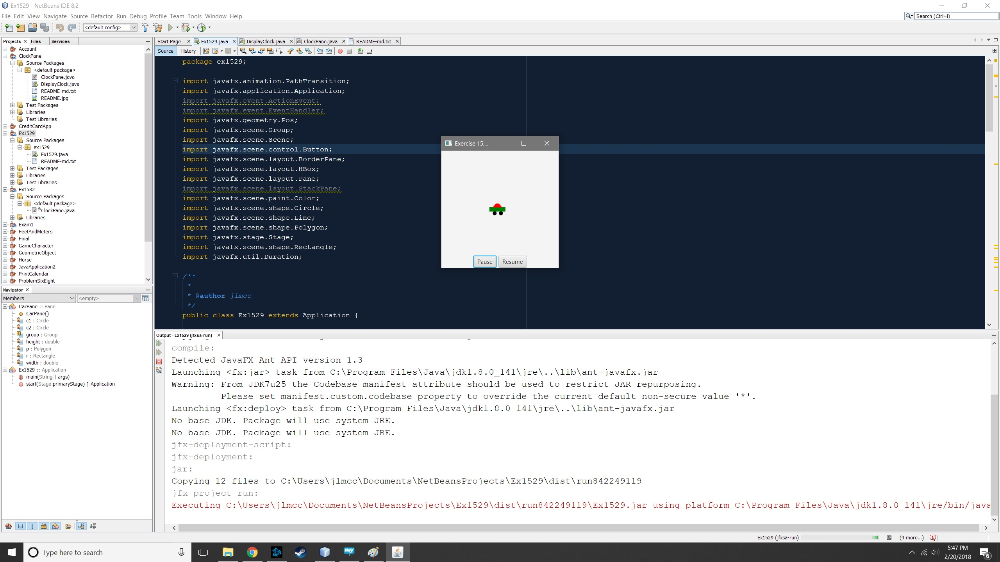

# Exercise 15.29

This project is the solution to Exercise 15.29. The exercise outlined that the program was to simulate car racing. The car is to move from left to right, and when it hits the right end it restarts from the left and continues the same process. The user is to be able to pause and resume the animation, as well as increase and decrease speed with the right and left arrow keys respectively.

## Example Output



## Analysis Steps

1. I began by creating the CarPane method to create the car. I put this in a method so it could be easily called upon many times if the program was ever modified to support multiple cars.
2. Once I had a car creating to the specifications in the book, I started animating the car. I did this via PathTransition and calling the car created to a line that is not displayed on screen.

### Design

Beyond setting the CarPane method up for future modification, and tackling the car before the animation, that was the extent of my design. In retrospect, I would have done more to encapsulate the animation (I carried this forward into Exercise 15.32)

```
CarPane()
```

### Testing

Below are the tests that were performed to verify the work.

1. Does the application start without error?

```
Pass
```

2. Does the car draw appropriately?

```
Pass
```

3. Does the car pass from left to right on the screen at runtime?

```
Pass
```

4. Does the car reset upon reaching the end of the stage, and begin again from the left?

```
Pass
```

5. Does the stop button function?

```
Pass
```

6. Does the start button function?

```
Pass
```

7. Does the car accelerate when the right arrow key is pressed?

```
Pass
```

8. Does the car decelerate when the left arrow key is pressed?

```
Pass
```

9. Do any of the buttons or keys throw an error when used?

```
Pass
```

End with an example of getting some data out of the system or using it for a little demo

## Notes

None.

## Do not change content below this line
## Adapted from a README Built With

* [Dropwizard](http://www.dropwizard.io/1.0.2/docs/) - The web framework used
* [Maven](https://maven.apache.org/) - Dependency Management
* [ROME](https://rometools.github.io/rome/) - Used to generate RSS Feeds

## Contributing

Please read [CONTRIBUTING.md](https://gist.github.com/PurpleBooth/b24679402957c63ec426) for details on our code of conduct, and the process for submitting pull requests to us.

## Versioning

We use [SemVer](http://semver.org/) for versioning. For the versions available, see the [tags on this repository](https://github.com/your/project/tags). 

## Authors

* **Billie Thompson** - *Initial work* - [PurpleBooth](https://github.com/PurpleBooth)

See also the list of [contributors](https://github.com/your/project/contributors) who participated in this project.

## License

This project is licensed under the MIT License - see the [LICENSE.md](LICENSE.md) file for details

## Acknowledgments

* Hat tip to anyone who's code was used
* Inspiration
* etc
