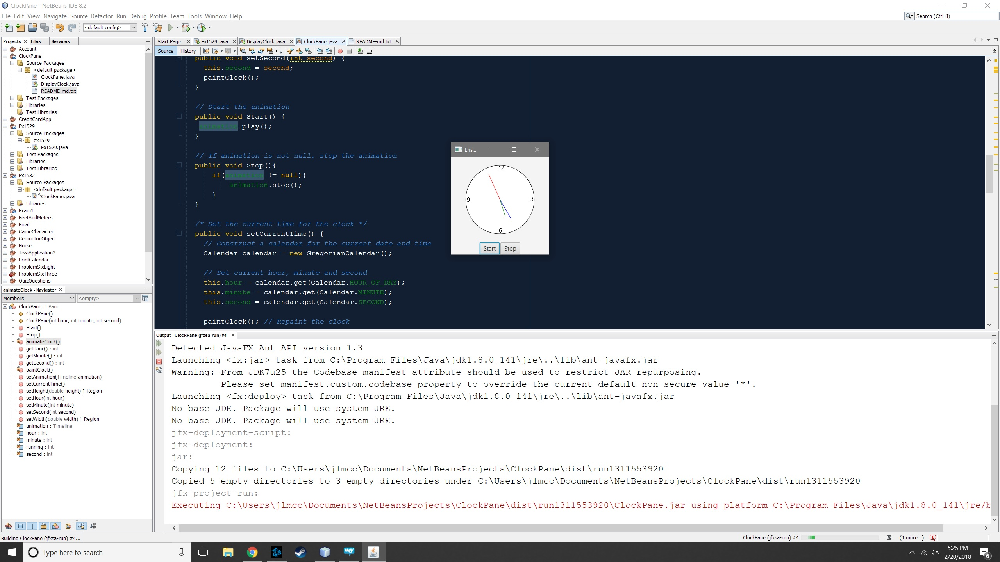

<!-- looks good - I had to create the README.md file under the correct name to get it to display correctly -->

# ClockPane

This project is the solution for Exercise 15.32. The exercise instructed to modify listing 14.21 (ClockPane.java) to add animation into the class as well as a start() and stop() method that allows the user to control the clock

## Example Output



## Analysis Steps

1. It made more sense to create a means to animate the clock first, and then find a means start and stop it after. I first began by examining the setCurrentTime() and paintClock() method to evaluate if it would be possible to use those methods to redraw the clock every second, effecting animation.
2. Once I determined it was not feasible to use the setCurrentTime() and paintClock() methods for animation (and probably not in line with the spirit of the assignment), I turned to Timeline.
3. I began with implimenting Timeline in the DisplayClock class. Once it was functional, I turned it into a method and moved it to the ClockPane class.
4. I then created the start() and stop() methods, and set up animation akin to hour/minute/second


### Design

Design wise, I tried to stick to encapsulation and limiting a method strictly to one "job". While I began with just getting things working in the DisplayClock class, once I knew they worked, I moved them to ClockPane in a more formal implimentation.

```
The animateClock() and setAnimation() methods are good examples of this.
```

### Testing

Below are the tests that were performed to verify the work. 

1. Does the application start without error?

```
Pass
```

2. Does the clock animation start at runtime?

```
Pass
```

3. Does the stop button function without error?

```
Pass
```

4. Does the start button function without error?

```
Pass
```

5. Does the start button cause an error while the animation is running, or the stop button throw an error while the animation is not running?

```
Pass
```

6. Is the time accurate?

```
Pass
```

jfx-project-run:
Executing C:\Users\jlmcc\Documents\NetBeansProjects\ClockPane\dist\run594189875\ClockPane.jar using platform C:\Program Files\Java\jdk1.8.0_141\jre/bin/java
Deleting directory C:\Users\jlmcc\Documents\NetBeansProjects\ClockPane\dist\run594189875
jfxsa-run:
BUILD SUCCESSFUL (total time: 10 seconds)

## Notes

None

## Do not change content below this line
## Adapted from a README Built With

* [Dropwizard](http://www.dropwizard.io/1.0.2/docs/) - The web framework used
* [Maven](https://maven.apache.org/) - Dependency Management
* [ROME](https://rometools.github.io/rome/) - Used to generate RSS Feeds

## Contributing

Please read [CONTRIBUTING.md](https://gist.github.com/PurpleBooth/b24679402957c63ec426) for details on our code of conduct, and the process for submitting pull requests to us.

## Versioning

We use [SemVer](http://semver.org/) for versioning. For the versions available, see the [tags on this repository](https://github.com/your/project/tags). 

## Authors

* **Billie Thompson** - *Initial work* - [PurpleBooth](https://github.com/PurpleBooth)

See also the list of [contributors](https://github.com/your/project/contributors) who participated in this project.

## License

This project is licensed under the MIT License - see the [LICENSE.md](LICENSE.md) file for details

## Acknowledgments

* Hat tip to anyone who's code was used
* Inspiration
* etc
