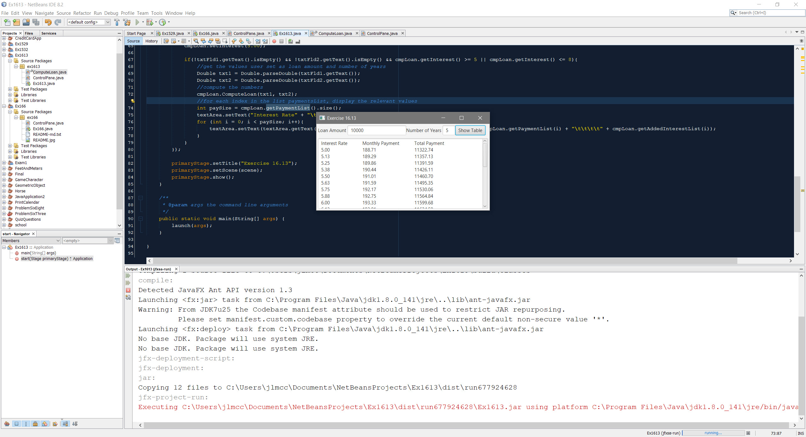

# Exercise 16.13

This exercise was to create a GUI base on an example from the book, and rewrite a formula from an example to accept a loan amount and term, and show the monthly payment and total amount payed for interest rates between 5 and 8 percent increasing by .125%

## Example Output



## Analysis Steps

I approached the exercise with much as I had prior exercises. I reused code from my prior work to handle the generation of textfields and labels, and focused my effort on getting the GUI accurate to the example. Once it was accurate, I began coding the logic in ComputeLoan.java. Once I felt it was producing output, I worked on the "Show Table" button showing values. I then bounced between making the numbers accurate, and getting the formatting correct.

### Design

I have stuck to prior design where I encapsulate tasks in classes, and make sure it's methods only contain "one" task or job.

```
ComputeLoan.java
ControlPane.java
```

### Testing

1. Does the application run without error?

```
Pass
```

2. Do the nodes appear and allow interaction?

```
Pass
```

3. Does the program throw an error when no text fields are populated?

```
Pass
```

4. Does the program display information when the text fields work?

```
Pass
```

5. Does the program display accurate information that is formatted appropriately?

```
Pass
```

## Notes

N/A

## Do not change content below this line
## Adapted from a README Built With

* [Dropwizard](http://www.dropwizard.io/1.0.2/docs/) - The web framework used
* [Maven](https://maven.apache.org/) - Dependency Management
* [ROME](https://rometools.github.io/rome/) - Used to generate RSS Feeds

## Contributing

Please read [CONTRIBUTING.md](https://gist.github.com/PurpleBooth/b24679402957c63ec426) for details on our code of conduct, and the process for submitting pull requests to us.

## Versioning

We use [SemVer](http://semver.org/) for versioning. For the versions available, see the [tags on this repository](https://github.com/your/project/tags). 

## Authors

* **Billie Thompson** - *Initial work* - [PurpleBooth](https://github.com/PurpleBooth)

See also the list of [contributors](https://github.com/your/project/contributors) who participated in this project.

## License

This project is licensed under the MIT License - see the [LICENSE.md](LICENSE.md) file for details

## Acknowledgments

* Hat tip to anyone who's code was used
* Inspiration
* etc
