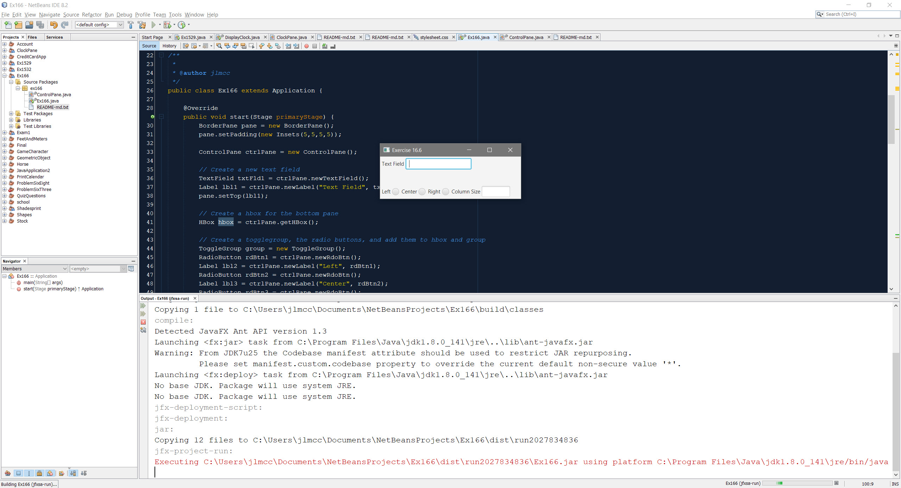

# Exercise 16.6

This project is the solution to Exercise 16.6, which asks to create a program that sets the horizontal alignment and column-width of a text field dynamically.

## Example Output



## Analysis Steps

I began with getting the GUI appearance set and functioning. I then created the ControlPane.java class to manage the creation of textfields, setters, and getters. Finally, I set about making the actual controls perform their function.

### Design

I wanted to implement a second class mostly to practice encapsulation and organize the heavy lifting of the program. 

```
newTextField() and newLabel() are good examples
```

### Testing

1. Does the application run without error?

```
Pass
```

2. Do the nodes appear and allow interaction?

```
Pass
```

3. Do the Left/Center/Right radio buttons align text appropriately?

```
Pass
```

4. Do the Left/Center/Right radio buttons throw an error if all fields are blank?

```
Pass
```

5. Does the Left/Center/Right radio buttons throw an error if only column width is populated?

```
Pass
```

6. Do the Left/Center/Right radio buttons align text appropriately while column width is blank?

```
Pass
```

## Notes

N/A

## Do not change content below this line
## Adapted from a README Built With

* [Dropwizard](http://www.dropwizard.io/1.0.2/docs/) - The web framework used
* [Maven](https://maven.apache.org/) - Dependency Management
* [ROME](https://rometools.github.io/rome/) - Used to generate RSS Feeds

## Contributing

Please read [CONTRIBUTING.md](https://gist.github.com/PurpleBooth/b24679402957c63ec426) for details on our code of conduct, and the process for submitting pull requests to us.

## Versioning

We use [SemVer](http://semver.org/) for versioning. For the versions available, see the [tags on this repository](https://github.com/your/project/tags). 

## Authors

* **Billie Thompson** - *Initial work* - [PurpleBooth](https://github.com/PurpleBooth)

See also the list of [contributors](https://github.com/your/project/contributors) who participated in this project.

## License

This project is licensed under the MIT License - see the [LICENSE.md](LICENSE.md) file for details

## Acknowledgments

* Hat tip to anyone who's code was used
* Inspiration
* etc
