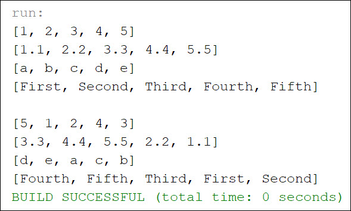

# Project Title

This project is the solution to Exercise 19.8

*Edit - Example Output (README.jpg) featured a shuffle that was identical to the original list. Ran again and uploaded a new README.jpg to showcase that the shuffle is indeed functioning for all elements*

## Example Output



## Analysis Steps

The exercise was to write the following method that shuffles an ArrayList:

```
public static <E> void shuffle(ArrayList<E> list)
```
  
I created a series of ArrayLists for Integer, Double, Character, and String and then printed them to demonstrate the order they are in. Using the method defined in the book, I then implimented Collections to perform the shuffle. Finally, I print the newly shuffled ArrayLists to demonstrate that they are properly shuffled.

### Design

I began in what might be the longest way around, which was researching various randomizing algorithms to attempt to impliment to randomize the order of the ArrayLists. I settled on the Durstenfeld method, and believe I had a functional implimentation. The problem became that I had performed the bulk of that using list as opposed to ArrayList. In researching and understanding why an Integer didn't like to be cast into an ArrayList, I tested and ultimately moved to using Collections instead.

### Testing

Does the program compile?

```
Pass
```

Does the program display the ArrayLists before shuffling appropriately?

```
Pass
```

Does the program display the ArrayLists appropriately after shuffling?

```
Pass
```

Does the program display a randomly shuffled ArrayList with different runs?

```
Pass
```

## Notes

Explain any issues or testing instructions.

## Do not change content below this line
## Adapted from a README Built With

* [Dropwizard](http://www.dropwizard.io/1.0.2/docs/) - The web framework used
* [Maven](https://maven.apache.org/) - Dependency Management
* [ROME](https://rometools.github.io/rome/) - Used to generate RSS Feeds

## Contributing

Please read [CONTRIBUTING.md](https://gist.github.com/PurpleBooth/b24679402957c63ec426) for details on our code of conduct, and the process for submitting pull requests to us.

## Versioning

We use [SemVer](http://semver.org/) for versioning. For the versions available, see the [tags on this repository](https://github.com/your/project/tags). 

## Authors

* **Billie Thompson** - *Initial work* - [PurpleBooth](https://github.com/PurpleBooth)

See also the list of [contributors](https://github.com/your/project/contributors) who participated in this project.

## License

This project is licensed under the MIT License - see the [LICENSE.md](LICENSE.md) file for details

## Acknowledgments

* Hat tip to anyone who's code was used
* Inspiration
* etc
