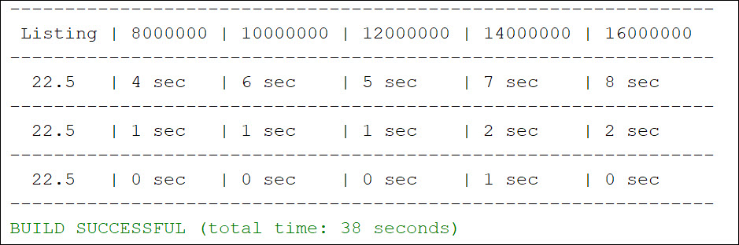

# Project Title

This project is the solution to Exercise 22.14

## Example Output



## Analysis Steps

The exercise was to create a program that measures the execution time for finding all the prime numbers for numbers less than 8000000, 10000000, 12000000, 14000000, and 16000000 using three different algorithms.

### Design

For the sake of simplicity, I opted for sticking to the Java console. I encapsulated each algorithm in it's own method, then went about organizing the data into a table.


### Testing

Does the program compile and run?

```
Pass
```

Does the program generate prime numbers?

```
Pass
```

Do each of the algorithm methods work and report back execution time elapsed?

```
Pass
```

Does the information display in a table?

```
Pass
```

## Notes

Explain any issues or testing instructions.

## Do not change content below this line
## Adapted from a README Built With

* [Dropwizard](http://www.dropwizard.io/1.0.2/docs/) - The web framework used
* [Maven](https://maven.apache.org/) - Dependency Management
* [ROME](https://rometools.github.io/rome/) - Used to generate RSS Feeds

## Contributing

Please read [CONTRIBUTING.md](https://gist.github.com/PurpleBooth/b24679402957c63ec426) for details on our code of conduct, and the process for submitting pull requests to us.

## Versioning

We use [SemVer](http://semver.org/) for versioning. For the versions available, see the [tags on this repository](https://github.com/your/project/tags). 

## Authors

* **Billie Thompson** - *Initial work* - [PurpleBooth](https://github.com/PurpleBooth)

See also the list of [contributors](https://github.com/your/project/contributors) who participated in this project.

## License

This project is licensed under the MIT License - see the [LICENSE.md](LICENSE.md) file for details

## Acknowledgments

* Hat tip to anyone who's code was used
* Inspiration
* etc
