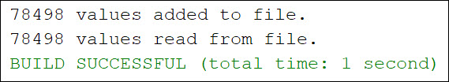

# Project Title

This project is the solution to Exercise 22.8

## Example Output



## Analysis Steps

The exercise was to create a program that finds all prime numbers between 0 and 1,000,000. file. 

### Design

The conditions of program were:

..* The program must store the prime numbers in a binary data file, named PrimeNumbers.dat
..* To determine if a number is prime, the program should load the prime numbers from the file to an array of the long type with a size of 10000. If no number is a divisor for the new prime number, continue to read the next 10000 prime numbers until a divisor is found or the file is read in full.

If the program is to scrutinize the prime numbers in the file for a divisor up to 1,000,000, then the prime number already exists in the file. This seemed to be a paradoxical requirement, so I created a method to generate prime numbers up to 1,000,000, write it to a file, then read it from the file and provide output. 

### Testing

Does the program compile?

```
Pass
```

Does the program display the ArrayLists before shuffling appropriately?

```
Pass
```

Does the program display the ArrayLists appropriately after shuffling?

```
Pass
```

Does the program display a randomly shuffled ArrayList with different runs?

```
Pass
```

## Notes

Explain any issues or testing instructions.

## Do not change content below this line
## Adapted from a README Built With

* [Dropwizard](http://www.dropwizard.io/1.0.2/docs/) - The web framework used
* [Maven](https://maven.apache.org/) - Dependency Management
* [ROME](https://rometools.github.io/rome/) - Used to generate RSS Feeds

## Contributing

Please read [CONTRIBUTING.md](https://gist.github.com/PurpleBooth/b24679402957c63ec426) for details on our code of conduct, and the process for submitting pull requests to us.

## Versioning

We use [SemVer](http://semver.org/) for versioning. For the versions available, see the [tags on this repository](https://github.com/your/project/tags). 

## Authors

* **Billie Thompson** - *Initial work* - [PurpleBooth](https://github.com/PurpleBooth)

See also the list of [contributors](https://github.com/your/project/contributors) who participated in this project.

## License

This project is licensed under the MIT License - see the [LICENSE.md](LICENSE.md) file for details

## Acknowledgments

* Hat tip to anyone who's code was used
* Inspiration
* etc
