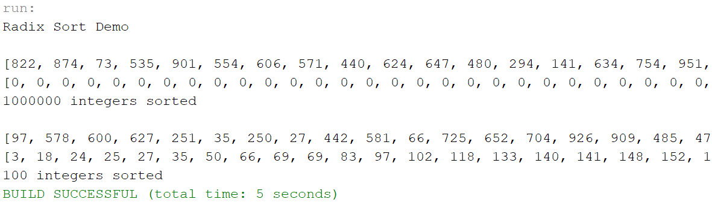

# Exercise 23.12

This project is the solution to Exercise 23.12

## Example Output



## Analysis Steps

The exercise was to create a program that demonstrates a radix sort by sorting a list of 1,000,000 random integers.

### Design

The conditions of program were:

1. The program must generate 1,000,000 random integers
2. To perform a radix sort to put the random integers in ascending order

Given the scale of 1,000,000 integers, I started with 100 instead. I began by studying a radix sort and reading as much material on it as I could. From there, I started coding what I thought was a representation of a radix sort. I realized that my solution was growing to be quite excessive, so I set it aside and went back to studying the radix sort in the interest of getting down to the bare function of the algorithm. I went back to coding the sort and was finally able to accomplish it. That is really understating the hours I put in to make it function, much to my own detriment.

I included a shorter ArrayList to actually demonstrate the sort, as well as some verbage to help illustrate what the code is doing.

### Testing

Does the program compile?

```
Pass
```

Does the program generate 1,000,000 random numbers.

```
Pass
```

Does the program perform a radix sort?

```
Pass
```

Do the random integers, after the sort, appear in the properly sorted order?

```
Pass
```

## Notes

Explain any issues or testing instructions.

## Do not change content below this line
## Adapted from a README Built With

* [Dropwizard](http://www.dropwizard.io/1.0.2/docs/) - The web framework used
* [Maven](https://maven.apache.org/) - Dependency Management
* [ROME](https://rometools.github.io/rome/) - Used to generate RSS Feeds

## Contributing

Please read [CONTRIBUTING.md](https://gist.github.com/PurpleBooth/b24679402957c63ec426) for details on our code of conduct, and the process for submitting pull requests to us.

## Versioning

We use [SemVer](http://semver.org/) for versioning. For the versions available, see the [tags on this repository](https://github.com/your/project/tags). 

## Authors

* **Billie Thompson** - *Initial work* - [PurpleBooth](https://github.com/PurpleBooth)

See also the list of [contributors](https://github.com/your/project/contributors) who participated in this project.

## License

This project is licensed under the MIT License - see the [LICENSE.md](LICENSE.md) file for details

## Acknowledgments

* Hat tip to anyone who's code was used
* Inspiration
* etc

