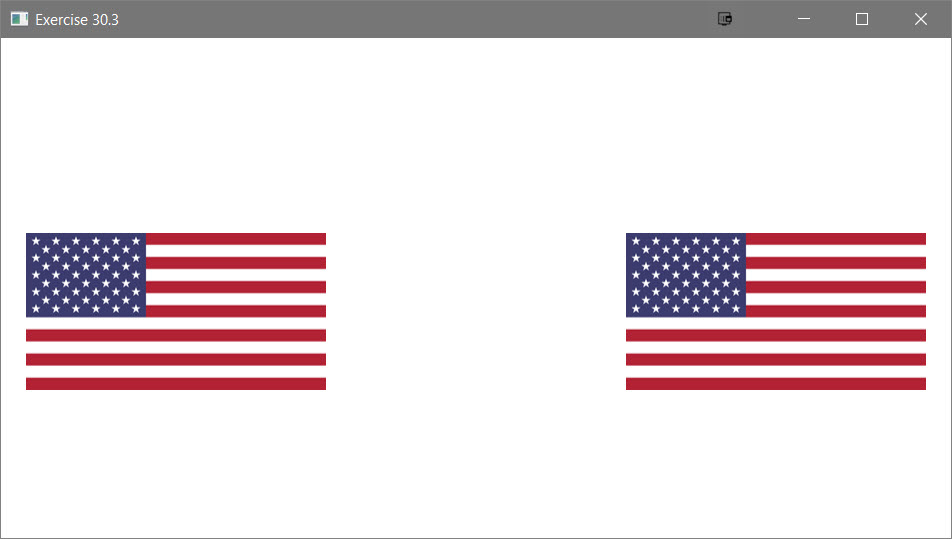

# Exercise 30.3

This project is the solution to Exercise 30.3

## Example Output



## Analysis Steps

The exercise was to 15.13 using a thread to animate a flag being raised

### Design

As of the due date 4/10/2018 this program is only partially functional. Inserting values works. Searching for values always returns a success, and deleting does not work at all. To my own detriment Exercise 23.12 received most of my attention, and Exercise 24.7 suffered. I will continue to work after the due date to get it functional.

### Testing

Does the program compile?

```
Pass
```

Does the program display the LinkedList

```
Pass
```

Does the program allow insertion of values to the LinkedList

```
Pass
```

Does the program successfully search for a value in the LinkedList

```
Fail
```

Does the program successfully delete a value from the LinkedList

```
Fail
```

Does the program print out the proper number of prime values added after reading from the file?

```
Pass
```

## Notes

Explain any issues or testing instructions.

## Do not change content below this line
## Adapted from a README Built With

* [Dropwizard](http://www.dropwizard.io/1.0.2/docs/) - The web framework used
* [Maven](https://maven.apache.org/) - Dependency Management
* [ROME](https://rometools.github.io/rome/) - Used to generate RSS Feeds

## Contributing

Please read [CONTRIBUTING.md](https://gist.github.com/PurpleBooth/b24679402957c63ec426) for details on our code of conduct, and the process for submitting pull requests to us.

## Versioning

We use [SemVer](http://semver.org/) for versioning. For the versions available, see the [tags on this repository](https://github.com/your/project/tags). 

## Authors

* **Billie Thompson** - *Initial work* - [PurpleBooth](https://github.com/PurpleBooth)

See also the list of [contributors](https://github.com/your/project/contributors) who participated in this project.

## License

This project is licensed under the MIT License - see the [LICENSE.md](LICENSE.md) file for details

## Acknowledgments

* Hat tip to anyone who's code was used
* Inspiration
* etc
