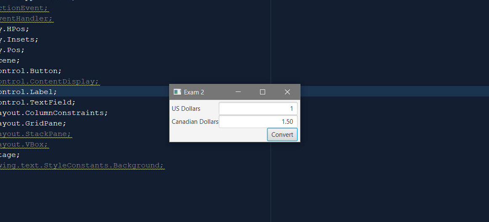

# Exam 2

This project is the solution to Exam 2, which asks to create a program that converts US Dollars to Canadian Dollars.

## Example Output



## Analysis Steps

I began with getting the GUI appearance set up similar to the example given. Once I was satisfied with it's appearance, I started programming the functionality.

### Design

While my programs through Chapter 16 have made use of at least one additional class to demonstrate proper encapsulation, I decided to keep the program simple given the time constraint and the simplicity of the sample.


### Testing

1. Does the application run without error?

```
Pass
```

2. Do the nodes appear and allow interaction?

```
Pass
```

3. Does the 'Convert' button throw an error when the fields are empty?

```
Pass
```

4. Does the 'Convert' button produce an output in the Canadian Dollar textfield if the US Dollar textfield is populated with a number?

```
Pass
```

5. Does the program throw an error if a non-number is entered into the US Dollar textfield?

```
Pass
```

## Notes

N/A

## Do not change content below this line
## Adapted from a README Built With

* [Dropwizard](http://www.dropwizard.io/1.0.2/docs/) - The web framework used
* [Maven](https://maven.apache.org/) - Dependency Management
* [ROME](https://rometools.github.io/rome/) - Used to generate RSS Feeds

## Contributing

Please read [CONTRIBUTING.md](https://gist.github.com/PurpleBooth/b24679402957c63ec426) for details on our code of conduct, and the process for submitting pull requests to us.

## Versioning

We use [SemVer](http://semver.org/) for versioning. For the versions available, see the [tags on this repository](https://github.com/your/project/tags). 

## Authors

* **Billie Thompson** - *Initial work* - [PurpleBooth](https://github.com/PurpleBooth)

See also the list of [contributors](https://github.com/your/project/contributors) who participated in this project.

## License

This project is licensed under the MIT License - see the [LICENSE.md](LICENSE.md) file for details

## Acknowledgments

* Hat tip to anyone who's code was used
* Inspiration
* etc
