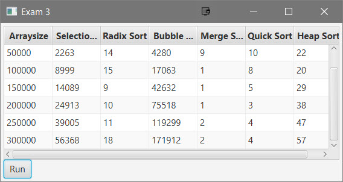

# Exam 3

This project is the solution to Exam 3

## Example Output



## Analysis Steps

The assignment was to create a program that obtains the execution time for a selection sort, radix sort, bubble sort, merge sort, quick sort, and heap sort for input size 50000, 100,000, 150,000, 200,000, 250,000, and 300,000. The data should be presented in a table.

### Design

I began by getting the nodes of the program functional and having everything in place to present the information. I decided to set up a separate class to store the sort methods as well as a few methods for obtaining the execution time. If time was not a factor, I would've created a method to handle the execution of each sort for each set of random integers, as well as tried to improve the run time.

### Testing

Does the program compile and run?

```
Pass
```

Do each of the sorts return a value for 50000 integers?

```
Pass
```

Do the run times for each sort of 50000 integers populate in the appropriate row?

```
Pass
```

Do each of the sorts return a value for 100000 integers?

```
Pass
```

Do the run times for each sort of 100000 integers populate in the appropriate row?

```
Pass
```

Do each of the sorts return a value for 150000 integers?

```
Pass
```

Do the run times for each sort of 150000 integers populate in the appropriate row?

```
Pass
```

Do each of the sorts return a value for 200000 integers?

```
Pass
```

Do the run times for each sort of 200000 integers populate in the appropriate row?

```
Pass
```

Do each of the sorts return a value for 250000 integers?

```
Pass
```

Do the run times for each sort of 250000 integers populate in the appropriate row?

```
Pass
```

## Notes

Explain any issues or testing instructions.

## Do not change content below this line
## Adapted from a README Built With

* [Dropwizard](http://www.dropwizard.io/1.0.2/docs/) - The web framework used
* [Maven](https://maven.apache.org/) - Dependency Management
* [ROME](https://rometools.github.io/rome/) - Used to generate RSS Feeds

## Contributing

Please read [CONTRIBUTING.md](https://gist.github.com/PurpleBooth/b24679402957c63ec426) for details on our code of conduct, and the process for submitting pull requests to us.

## Versioning

We use [SemVer](http://semver.org/) for versioning. For the versions available, see the [tags on this repository](https://github.com/your/project/tags). 

## Authors

* **Billie Thompson** - *Initial work* - [PurpleBooth](https://github.com/PurpleBooth)

See also the list of [contributors](https://github.com/your/project/contributors) who participated in this project.

## License

This project is licensed under the MIT License - see the [LICENSE.md](LICENSE.md) file for details

## Acknowledgments

* Hat tip to anyone who's code was used
* Inspiration
* etc
